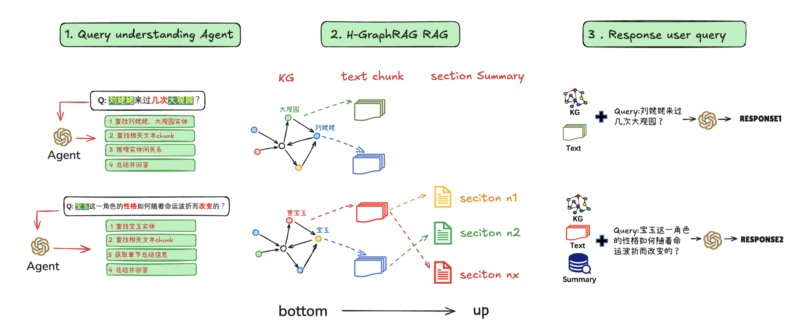
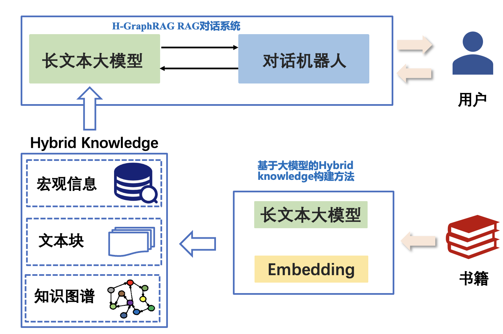
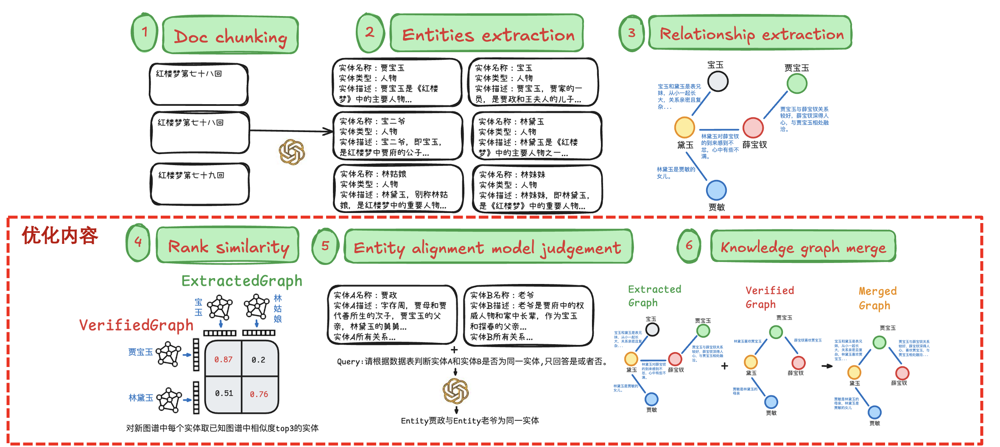
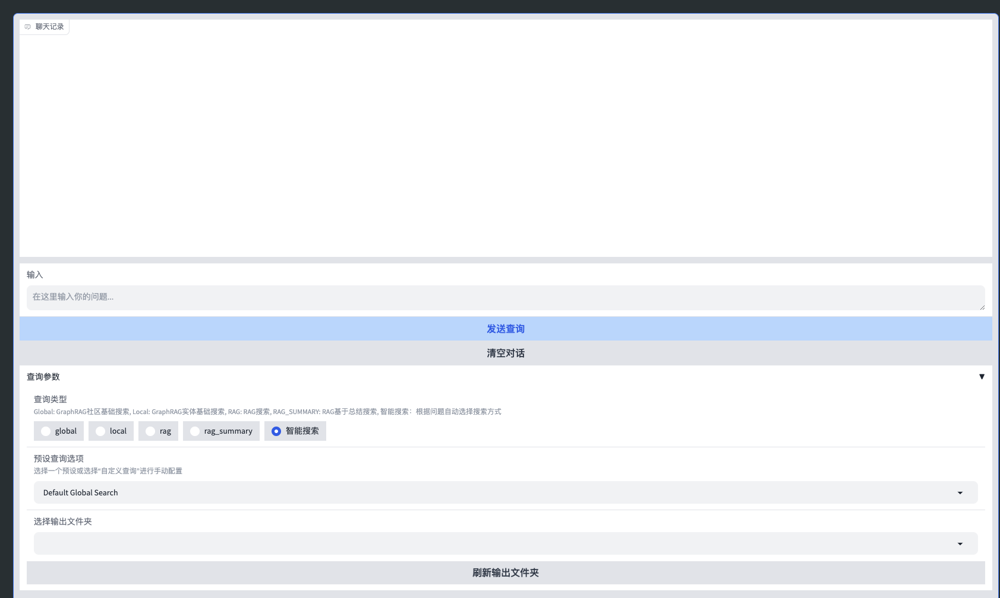

<div align="center"><h1>长文本深层知识问答</h1></div>

## 目录

- [项目介绍](#项目介绍)
- [环境搭建](#环境搭建)
- [运行准备](#运行准备)
- [构建索引](构建索引)
- [Limitations](#limitations)

## 项目介绍

H-GraphRAG是一个回答系统，通过Agent使不同的问题被路由到不同的RAG路径，并通过构建的高质量的知识图谱，使模型围绕这些核心实体来检索信息，并生成幻觉更少、更全面的回答。



H-GraphRAG为研究者提供了易用的模块，包括:

- **（名著）文本按章节切分并加入metainfo**
- **GraphRAG抽取实体并构建社区** 
- **已有知识图谱与GraphRAG生成的知识图谱的融合**
- **Agent判断问题类型并利用大模型使用对应的RAG路径进行检索**



## 环境搭建
1. 下载需要的python包:
```shell
pip install requirements_graphrag.txt
```
2. 激活环境
```shell
conda activate graphrag
```

## 运行准备
1. 创建测试目录
```shell
mkdir -p ./ragtest_test2/input
```
2. 按章节切分名著，将测试数据存到input目录
```shell
process_document.ipynb
```
3. 初始化项目
```shell
python -m graphrag.index --init --root ./ragtest_test2
```
该步骤会在测试目录（ragtest_test2）下生成相关的prompt及配置文件

4. 修改settings.yaml及env文件，这些配置文件包括LLM和Embedding模型，以及索引和查询使用的相关参数

5. 开启ollama embedding服务
```shell
ollama serve
```
在另一cli运行
```shell
ollama run bge-m3
```

## 构建索引

1. 构建GraphRAG索引
```shell
防止中断从头开始，强烈建议加上resume参数
python -m graphrag.index --root ./ragtest_test2 --resume test
中途可能因为rate limit导致中途中断，配置resume参数之后，失败了重新跑一遍就可以，也可以调小yaml文件中的concurrent_requests值
该步骤可能碰到的错误见，常见问题汇总.md
```

2. 构建RAG索引
```shell
python rag_index.py --root ./ragtest_test2 --output hongloumeng2
```

3. 生成每个章节的概括并构建RAG索引
```shell
python rag_index_summary.py --root ./ragtest_test2 --output hongloumeng2
```

4. （optional）将已有知识图谱导入neo4j，并与GraphRAG索引生成的graph进行merge
将已有图谱导入neo4j：neo4j_load_graphrag.ipynb
知识图谱merge：
```shell
python graph_merge.py
```


## 查询
```shell
python app.py --root ragtest_test2
```


选择需要的查询类型和输出文件夹后，在输入框里输出问题即可。如果选择智能搜索，系统会根据问题自动选择合适的搜索方式。
